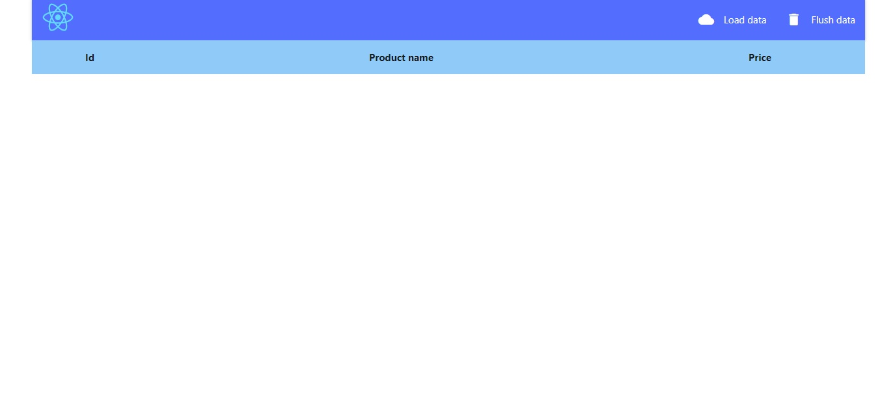
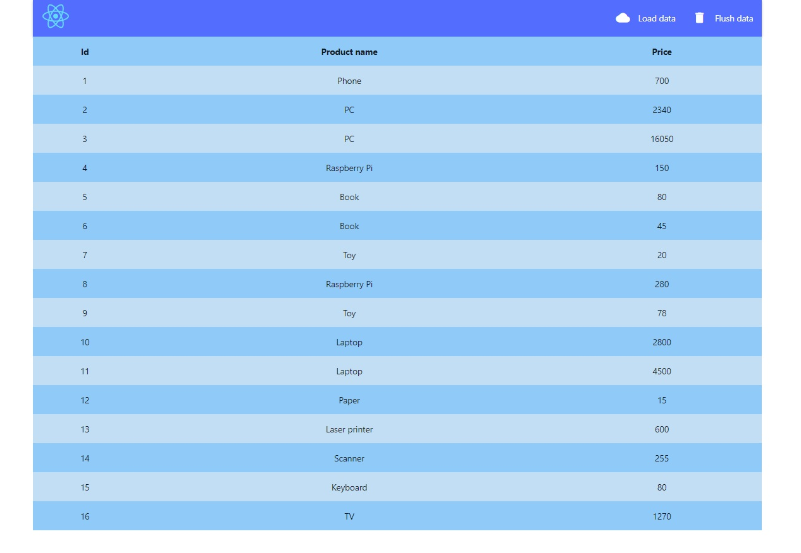
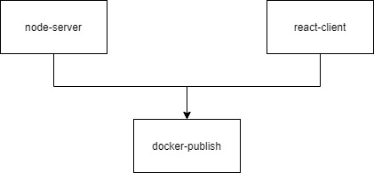

# ASK 2020 Nodejs-React app
**Cel ćwiczenia:**

## Uruchomienie aplikacji
Aplikacja składa się z trzech części:
1. Klient, napisany z wykorzystaniem [React.js](https://reactjs.org/). Do uruchomienia jej bez dockera wystarczy uruchomić z katalogu [./client](./client) polecenie `npm start`. Wymaga zainstalowanego nodejs oraz npm. W dockerze uruchamiany jest jako static content w [nginx](https://www.nginx.com/).
2. Serwer to API w nodejs. Do uruchomienia lokalnie najprościej skorzystać z polecenia `npm run dev`. W przypadku uruchomienia w kontenerze instalowane są _wyłącznie_ zależności produkcyjne (deweloperskie są pomijane).
3. Baza danych była testowana pod mysql-8.0.20, jednak powinna bez problemu działać również pod mariadb. Lokalnie należy zaimportować dane ze skryptu [db.sql](db/db.sql). Dla ułatwienia uruchomienia w kontenerze, przygotowany został prosty Dockerfile, importujący dane automatycznie.

Aplikację najprościej uruchomić przez docker-compose: `docker-compose up`. Uruchomienie może potrwać dłużej, jeżeli niezbędne obrazy bazowe nie są dostępne lokalnie. Więcej opcji uruchamiania można znaleźć w [dokumentacji docker-compose](https://docs.docker.com/compose/reference/up/). Warto też zapoznać się z [budowaniem przez docker-compose](https://docs.docker.com/compose/reference/build/).

Poprawnie działająca aplikacja powinna wyglądać następująco:

Jeżeli uruchomione zostały wszystkie trzy kontenery, po naciśnięciu przycisku _Load data_ powinny wyświetlić się produkty:

## Testowanie aplikacji
Do celów niniejszego zadania przygotowane zostały proste testy aplikacji klienckiej i serwerowej. Aby uruchomić je lokalnie należy wpierw zainstalować wszystkie zależności poleceniem `npm install`, a następnie je wywołać poprzez `npm test`. W przypadku aplikacji klienckiej warto wcześniej zapoznać się z [testowaniem w CRA](https://create-react-app.dev/docs/running-tests), by uniknąć błędów. Modyfikacja kodu żadnej z aplikacji **nie jest konieczna**, by zarówno uruchamianie jak i testowanie działało poprawnie.

## Zadania
1. Korzystając z [CircleCI](https://circleci.com/) lub [TravisCI](https://travis-ci.org/) wykonaj automatyczne testowanie aplikacji klienckiej i serwerowej. Warto tutaj mieć na uwadze następujące kwestie:
    1. Uruchamiając każdą z aplikacji należy pamiętać, że w repozytorium nie ma katalogu *node_modules*, gdzie przechowywane są wszystkie zależności. Do ich zainstalowania należy wykorzystać polecenie `npm install`. Dopiero po tej operacji można wywołać polecenie `npm test`.
    2. Istnieje możliwość uruchomienia testów automatycznych w kontenerze, budując wcześniej _odpowiedni_ obraz. Przygotowane Dockefile nie są do tego przystosowane i mogą wymagać niewielkich modyfikacji (np. serwer instaluje wyłącznie zależności produkcyjne i nie kopiuje katalogu z testami do obrazu).
2. Po prawidłowym przejściu procedury testowania, zbuduj obraz (o ile nie zostało to wykonane w poprzednim zadaniu) i opublikuj go na portalu [DockerHub](https://hub.docker.com/).
3. Zadbaj, o ile to możliwe, by testy każdej z aplikacji wykonywane były równolegle a opublikowanie dopiero po pozytywnym wyniku z poprzednich zadań. Workflow powinien wyglądać następująco:

    
4. Zmodyfikuj config w taki sposób, by publikowanie odbywało się wyłącznie dla brancha master.

## Uwagi
1. Zastanów się, czy wszystkie obrazy należy publikować na DockerHubie.
2. Należy ostrożnie korzystać z opcji detached w dockerze (-d, --detached). W przypadku developmentu pozbawia często wyświetlania ewentualnych błędów w trakcie uruchamiania. Wprawdzie można to odzyskać poleceniem `docker logs`, jednak w przypadku testowania automatycznego może spowodować to zawieszenie lub zatrzymanie testowania z błędem.

## Materiały
1. [Docker-compose getting started](https://docs.docker.com/compose/gettingstarted/)
2. [Docker build stages](https://medium.com/@tonistiigi/advanced-multi-stage-build-patterns-6f741b852fae)
3. Nginx + react static content:
    1. https://geekflare.com/nginx-static-files-node-js/
    2. https://stackoverflow.com/questions/59973882/proxying-react-app-using-nginx-on-docker-compose
4. Budowanie obrazów na CircleCI:
    1. https://circleci.com/docs/2.0/building-docker-images/
    2. https://circleci.com/orbs/registry/orb/circleci/docker
5. Budowanie obrazów na TravisCI:
    1. https://docs.travis-ci.com/user/docker/
    2. https://docs.travis-ci.com/user/build-stages/share-docker-image/
    3. https://www.basefactor.com/hello-docker-travis-ci-cd
6. [CI process with docker and react app](https://medium.com/swlh/an-example-ci-process-for-react-apps-with-docker-2247171a218)
